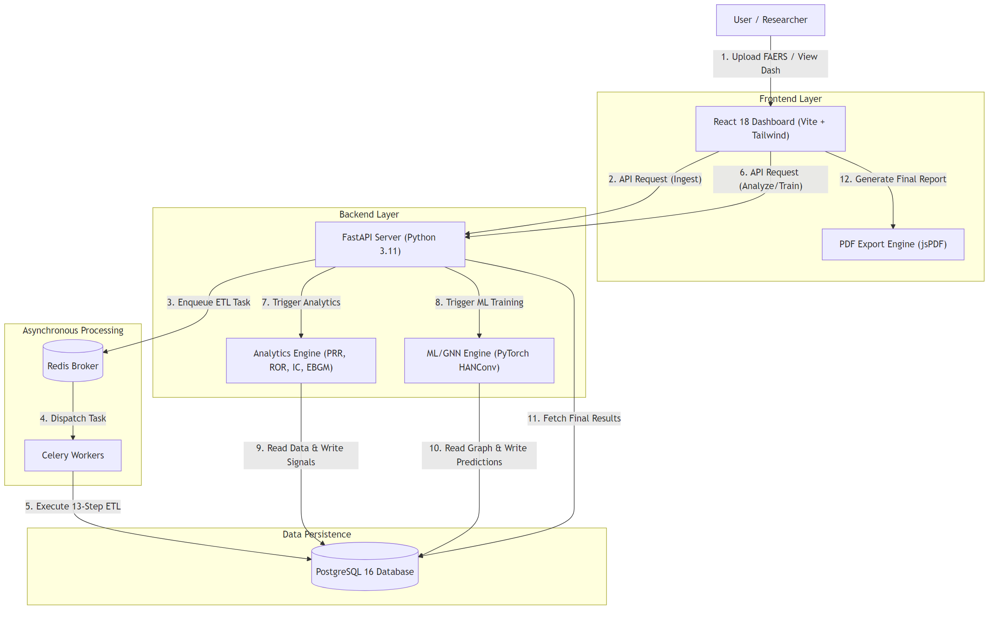
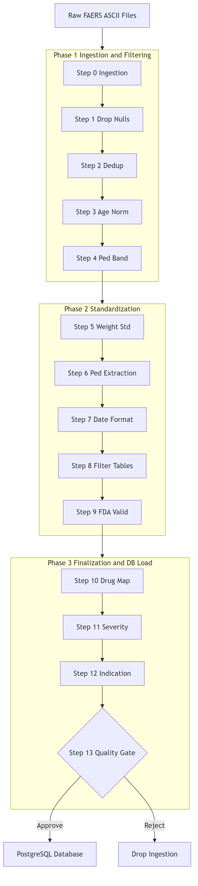
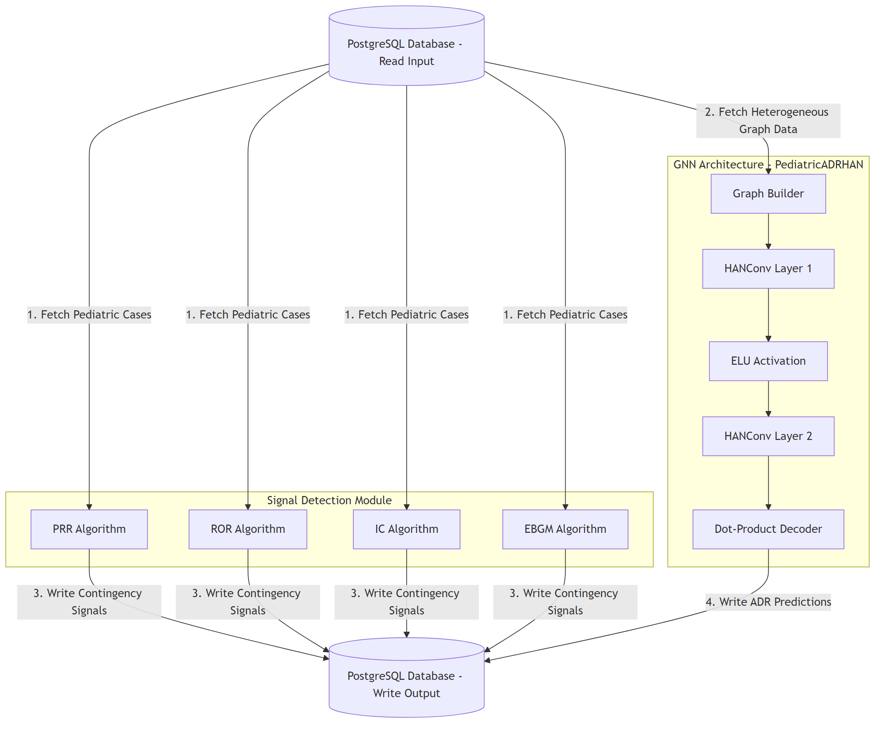

# PulseTech FAERS Pediatric ADR Dashboard

> [!IMPORTANT]
> **⚖️ Copyright Notice & Intellectual Property Registration**  
> * **Work Title:** PulseTech FAERS Pediatric ADR Dashboard  
> * **Authors & Claimants:** Atherv Deepak Telkar & Amey Deepak Telkar  
> * **Registration Class:** Computer Software / Literary Work (Under Copyright Registration Process, 2026)  
> * **Filing Organization:** PulseTech Team (ANC-031)  
> * **Rights Statement:** All rights reserved. Unauthorized copying, distribution, publishing, or reproduction of this source code, layout, or documentation in any form is strictly prohibited under international copyright laws.

[](#license)
[-blue.svg)](#team)
[](https://www.python.org/)
[](https://react.dev/)
[](https://fastapi.tiangolo.com/)
[](https://www.postgresql.org/)

A **research-grade pharmacovigilance dashboard** for analyzing **Adverse Drug Reactions (ADRs) in the pediatric population** using FDA FAERS data (2021Q1–2025Q4). By integrating a **13-step ETL pipeline**, **4-metric disproportionality signal detection** (PRR, ROR, IC, EBGM), and a **Heterogeneous Graph Attention Network (HANConv)**, this system identifies known and novel pediatric drug safety signals across ICH E11(R1) developmental age bands.

---

## 👥 Authors & Team

| Author | Institution | Role |
|--------|-------------|------|
| **Atherv Deepak Telkar** | MIT Vishwaprayag University | Co-Lead · Backend, ML/GNN, Data Pipeline |
| **Amey Deepak Telkar** | MIT Vishwaprayag University | Co-Lead · Frontend, DevOps, Documentation |

**Team Name:** PulseTech (ANC-031)  
**Guides:** Prof. Darshan Ruikar, Prof. Preethi Baligar

---

## 📊 Key Results — Signal Detection (FAERS 2021Q1–2025Q4)

| Metric | Value |
|--------|-------|
| Raw FAERS records processed | **7,612,804** |
| Adolescent reports (12–17 yrs) | **403,278** |
| Obesity-related drug panel | 11,701 reports (14 drugs) |
| Diabetes-related drug panel | 5,208 reports (10 drugs) |
| Drug-event pairs evaluated | **2,098** |
| ROR signals (N≥3, 95% CI lower >1) | **360** |
| Four-metric concordant signals | **105** |

**Key pharmacovigilance signals discovered:**
- **Metformin → Lactic Acidosis** (ROR = 61.22, 95% CI 25.21–148.68)
- **Semaglutide → Optic Ischaemic Neuropathy** (ROR = 439.23) — 4-metric concordant
- **Dapagliflozin → Cardiac Failure** (ROR = 40.24)
- **Atorvastatin → Myalgia** (ROR = 16.89)

---

## 🏗️ System Architecture

The dashboard is built on a distributed microservices architecture designed to handle large-scale demographic and clinical event datasets. The 12-step numbered flow below shows the complete data journey from raw file upload to final PDF report generation.

<p align="center">
  
</p>

### Architecture Flow (Numbered Steps)

| Step | Component | Description |
|:---:|-----------|-------------|
| 1 | **User → React Dashboard** | Researcher uploads 7 raw FAERS ASCII `.txt` files or views existing data |
| 2 | **React → FastAPI** | Frontend streams files to the backend via REST API |
| 3 | **FastAPI → Redis** | Backend enqueues an ETL task ticket to the message broker |
| 4 | **Redis → Celery** | Broker dispatches the task to background worker processes |
| 5 | **Celery → PostgreSQL** | Worker executes the 13-step ETL pipeline and bulk-inserts clean data |
| 6 | **React → FastAPI** | User requests analysis (signals, GNN training) with selected filters |
| 7 | **FastAPI → Analytics Engine** | Backend triggers disproportionality computation (PRR, ROR, IC, EBGM) |
| 8 | **FastAPI → ML/GNN Engine** | Backend triggers PyTorch HANConv model training |
| 9 | **Analytics → PostgreSQL** | Computed signal scores are written back to the database |
| 10 | **GNN → PostgreSQL** | Novel ADR predictions are stored in results tables |
| 11 | **FastAPI → PostgreSQL** | Backend fetches final computed results for display |
| 12 | **React → PDF Export** | Dashboard renders visualizations; jsPDF generates downloadable PDF |

---

## 🛠️ Tech Stack

| Layer | Technologies | Description |
|:---|:---|:---|
| **Frontend** | React 18, Vite, TailwindCSS 3, Recharts, Cytoscape.js, Zustand, Lucide Icons | Responsive dashboard UI with interactive visualizations and graph network views |
| **Backend** | FastAPI (Python 3.11), SQLAlchemy 2.0, Alembic, Uvicorn | Async REST API with ORM, migrations, and background task triggers |
| **Database** | PostgreSQL 16, asyncpg, psycopg2 | Relational store for normalized DEMO, DRUG, REAC, OUTC, INDI, THER, RPSR tables |
| **Task Queue** | Celery + Redis | Asynchronous ETL pipeline execution and model training |
| **ML & GNN** | PyTorch, PyTorch Geometric (HANConv), XGBoost, scikit-learn, SHAP | Heterogeneous graph learning and gradient-boosted tree classifiers |
| **Signal Detection** | PRR, ROR, IC (WHO-UMC), EBGM (DuMouchel GPS) | 4-metric disproportionality analysis via 2×2 contingency tables |
| **Export** | jsPDF, html2canvas | Client-side PDF report generation with embedded charts |
| **DevOps** | Docker, Docker Compose, Git/GitHub | Containerized deployment and version control |

---

## 🔄 The 13-Step Data Ingestion & Cleaning Pipeline

Raw FDA FAERS data contains extensive duplicates, missing values, inconsistent units, and non-standard drug naming. The PulseTech ETL pipeline cleanses, normalizes, and filters raw inputs across **3 phases and 13 stages** before committing entries to PostgreSQL.

<p align="center">
  
</p>

### 📋 Detailed Pipeline Stages

| Step | Phase | Component | Logic & Transformations |
|:---:|:---:|:---|:---|
| **S0** | 1 | `validator.py` | Auto-detects file type (DEMO, DRUG, etc.) via header signatures. Validates `$`-delimiter integrity |
| **S1** | 1 | `validator.py` | Drops technical columns with >90% null counts (e.g., `auth_num`, `lit_ref`, `mfr_num`) |
| **S2** | 1 | `deduplicator.py` | Deduplicates using `caseid` + `MAX(caseversion)`. Tied records broken via 4-level fallback |
| **S3** | 1 | `age_normalizer.py` | Converts ages from Days, Weeks, Months, Years, Decades, Hours → single decimal years format |
| **S4** | 1 | `age_normalizer.py` | Classifies patients into **ICH E11 age bands**: Neonate (<28d), Infant (28d–2y), Child (2–12y), Adolescent (12–18y) |
| **S5** | 2 | `age_normalizer.py` | Normalizes weight fields to kilograms (converting lbs, oz, g, mg) |
| **S6** | 2 | `pediatric_filter.py` | Drops rows where age ≥ 18. Retains NULL age reports to preserve signal sensitivity |
| **S7** | 2 | `date_handler.py` | Parses partial dates (YYYYMM, YYYY) using first-of-month/year imputations |
| **S8** | 2 | `orchestrator.py` | Cascading join filters on child tables (DRUG, REAC) removing adult DEMO IDs |
| **S9** | 2 | `deduplicator.py` | Removes invalid drugs (`val_vbm` = 2) and filters out `role_cod` = 'DN' |
| **S10** | 3 | `drug_normalizer.py` | Cleans raw strings, resolves synonyms via RxNorm API, normalizes route variants |
| **S11** | 3 | `outcome_scorer.py` | Maps multi-outcome letters to severity scores: Death(7), Life-threatening(6), Hospitalization(5), Congenital(4), Disability(3), Required Intervention(2), Other(1) |
| **S12** | 3 | `orchestrator.py` | Cleans placeholder indications (e.g., 'UNKNOWN INDICATION') to NULLs |
| **S13** | 3 | `orchestrator.py` | **Quality Gate** — Tags rows with source quarter metadata (e.g., `2025Q1`) and validates data integrity before final DB commit |

---

## 🧠 ML & Analytics Component Architecture

The analytical backend consists of two parallel processing engines: a **Signal Detection Module** (statistical) and a **GNN Architecture** (deep learning), both reading from and writing results to PostgreSQL.

<p align="center">
  
</p>

### Signal Detection Module

The module operates on 2×2 contingency tables, running four pharmacovigilance metrics:

$$\begin{array}{c|cc}
& \text{Reaction of Interest} & \text{Other Reactions} \\
\hline
\text{Drug of Interest} & a & b \\
\text{Other Drugs} & c & d \\
\end{array}$$

| Metric | Description | Signal Threshold |
|--------|-------------|-----------------|
| **PRR** (Proportional Reporting Ratio) | Proportion of the reaction among reports for this drug vs. others | PRR ≥ 2, χ² ≥ 4, N ≥ 3 |
| **ROR** (Reporting Odds Ratio) | Odds of the reaction with the target drug vs. without it | Lower 95% CI > 1 |
| **IC** (Information Component) | Bayesian logarithmic measure from WHO-UMC methodology | IC₀₂₅ > 0 |
| **EBGM** (Empirical Bayes Geometric Mean) | Multi-item gamma-Poisson shrinkage for low cell counts | EB05 ≥ 2 |

### GNN Architecture — PediatricADRHAN

| Layer | Description |
|-------|-------------|
| **Graph Builder** | Converts tabular DB data into heterogeneous graph (Drug, Patient, Reaction nodes; takes_drug, experiences, associated_with edges) |
| **HANConv Layer 1** | 4-head Heterogeneous Graph Attention Network layer with dropout=0.3 |
| **ELU Activation** | Exponential Linear Unit for non-linearity |
| **HANConv Layer 2** | Single-head attention layer refining learned embeddings |
| **Dot-Product Decoder** | Computes edge probability scores for novel drug-reaction link prediction |

---

## 🖥️ 7-Page Dashboard Features

| # | Page | Description |
|---|------|-------------|
| 1 | **Upload Hub** | Upload raw multi-quarter FAERS files. Real-time parsing progress with background worker status |
| 2 | **Demographics** | Interactive age-sex pyramids, weight distributions, geographical reporter maps |
| 3 | **ADR Analysis** | Top adverse reactions, drug frequencies, and severity scores across ICH E11 age groups |
| 4 | **Signal Detection** | Filter and search PRR, ROR, IC, EBGM metrics with custom threshold configurations |
| 5 | **GNN Network View** | Interactive Cytoscape.js graph visualization of predicted drug-reaction associations with training loss curves |
| 6 | **Outcomes & Severity** | Breakdown of severity levels (Death, Hospitalization, etc.) by developmental age bands |
| 7 | **Report Builder** | Generates structured summaries with dynamic graphs; exports as downloadable PDF |

---

## 🎯 Project Milestones & Weekly Progress

### Milestones

| # | Milestone | Description | Status |
|---|-----------|-------------|--------|
| M1 | **Data Pipeline & Database** | FAERS ingestion, 13-stage ETL pipeline, PostgreSQL schema design, multi-quarter architecture | ✅ Completed |
| M2 | **Signal Detection Engine** | ROR, PRR, BCPNN IC, EBGM computation with PostgreSQL stored procedures | ✅ Completed |
| M3 | **ML Model Training** | XGBoost, Random Forest, HANConv GNN training across 4 adolescent cohorts with leakage ablation | ✅ Completed |
| M4 | **Dashboard Frontend** | 7-page React 18 dashboard with Recharts, Cytoscape.js graph visualization, PDF export | ✅ Completed |
| M5 | **Research Paper & Reproducibility** | PLOS ONE manuscript (LaTeX), code reproducibility package, STROBE/READUS-PV checklists | ✅ Completed |
| M6 | **Project Management, Testing & Final Polish** | Jira setup, unit tests, API docs, temporal validation, presentation | 🔄 In Progress |

---

### Week 1 Progress (Sept 15–21, 2026)

#### Atherv Deepak Telkar — Backend, ML & Data Pipeline

| Task | Status |
|------|--------|
| FastAPI backend with 10 API routers (auth, demographics, GNN, outcomes, PDF export, reactions, reports, signals, upload, utils) | ✅ |
| 13-stage FAERS data pipeline (deduplication, ICH E11 age stratification, RxNorm normalization, MedDRA coding) | ✅ |
| 4-metric signal detection engine (ROR, PRR, BCPNN IC, EBGM) with PostgreSQL stored procedures | ✅ |
| HANConv GNN training (PyTorch Geometric) for drug-ADR link prediction on obesity cohorts | ✅ |
| XGBoost & Random Forest training for 6-class outcome severity across 4 cohorts + leakage ablation | ✅ |
| PostgreSQL schema design with SQLAlchemy 2.0 ORM + Alembic migrations | ✅ |
| Co-authored GNN Dashboard research paper (LaTeX) for PLOS ONE | ✅ |

#### Amey Deepak Telkar — Frontend, DevOps & Documentation

| Task | Status |
|------|--------|
| 7-page React 18 + Vite + TailwindCSS dashboard (Upload Hub, Demographics, ADR Analysis, Signal Detection, GNN Network, Outcomes, Report Builder) | ✅ |
| GitHub private repo setup, 9 commits across full development lifecycle | ✅ |
| PLOS ONE manuscript submission package (v16) + code reproducibility scripts | ✅ |
| Docker + docker-compose configuration for full-stack deployment | ✅ |
| Authentication system, frontend security layer, build protection | ✅ |
| README documentation with architecture diagrams and key results | ✅ |
| Reference verification — fixed 8 fabricated references with verified papers | ✅ |

---

### Week 2 Planned Tasks (Sept 22–28, 2026)

| Task | Assignee | Priority |
|------|----------|----------|
| Set up Jira project, add team members, create Epics & Sprints | Amey | 🔴 High |
| Populate Jira board with Week 1 tasks (Done) + Week 2 sprint | Amey | 🔴 High |
| Dashboard UI polish — responsive layouts, loading states, error boundaries | Amey | 🟡 Medium |
| Temporal split validation (train 2021–2024, test 2025) for XGBoost | Atherv | 🟡 Medium |
| Extend HANConv GNN training to Diabetes All & Diabetes Selected 4 cohorts | Atherv | 🟡 Medium |
| Add Swagger/OpenAPI descriptions to all FastAPI endpoints | Atherv | 🟢 Low |
| Add pytest test suite for signal detection and ML pipeline | Atherv | 🟡 Medium |
| Prepare project demo presentation for class | Amey | 🔴 High |

---

## 🏥 Understanding NULL vs. Unknown Ages

A key database constraint prevents the loss of clinical reports that omit patient age:

* **NULL (Empty Field):** Age field in the original report was blank
* **Unknown (Pipeline Flag):** Set to `True` only if **both** numeric age and `age_grp` are absent. If a report has `age_grp = INF` (Infant) but no numeric age, the pipeline estimates age (e.g., 0.5 years) and maps it to the `INFANT` cohort
* **Clinical Defense:** Omitting unknown ages would delete over **85%** of raw data. Retaining them preserves critical safety signal sensitivity

---

## 🚀 Quick Start

### 1. Run via Docker Compose (Recommended)
```bash
docker-compose up --build -d
```

### 2. Manual Startup (Windows / PowerShell)

#### Backend & Celery (Terminal 1 & 2)
```powershell
# Install dependencies
pip install -r backend/requirements.txt

# Run Backend
$env:SKIP_RXNORM="1"
$env:PYTHONIOENCODING="utf-8"
cd backend
uvicorn app.main:app --host 0.0.0.0 --port 8000 --reload
```
```powershell
# Start Celery Worker (separate terminal)
cd backend
celery -A celery_worker worker --loglevel=info
```

#### Frontend (Terminal 3)
```powershell
cd frontend
npm install
npm run dev
```

### 3. Verification Addresses
* **Dashboard:** [http://localhost:5173](http://localhost:5173)
* **API Docs (Swagger):** [http://localhost:8000/docs](http://localhost:8000/docs)
* **Health Check:** [http://localhost:8000/api/health](http://localhost:8000/api/health)

---

## 📁 Repository Structure

```
faers-pediatric-adr/
├── backend/                     # FastAPI Application
│   ├── app/
│   │   ├── pipeline/            # 13-Step ETL Processing Engine
│   │   ├── analytics/           # Disproportionality Metrics (PRR, ROR, IC, EBGM)
│   │   ├── gnn/                 # PyTorch Geometric HANConv GNN
│   │   ├── models/              # SQLAlchemy ORM Models
│   │   ├── routers/             # API Endpoints (10 routers)
│   │   ├── core/                # Core utilities
│   │   ├── main.py              # FastAPI application entry point
│   │   ├── database.py          # Database connection & session management
│   │   └── security.py          # Authentication & authorization
│   ├── alembic/                 # DB Schema Versioning / Migrations
│   ├── celery_worker.py         # Background Task Entry Point
│   ├── stored_proc.sql          # Signal detection stored procedures
│   └── requirements.txt         # Python dependencies
├── frontend/                    # React 18 SPA
│   ├── src/
│   │   ├── pages/               # 7 Dashboard Pages
│   │   │   ├── UploadHub.jsx
│   │   │   ├── Demographics.jsx
│   │   │   ├── ADRAnalysis.jsx
│   │   │   ├── SignalDetection.jsx
│   │   │   ├── GNNNetworkView.jsx
│   │   │   ├── OutcomesSeverity.jsx
│   │   │   └── ReportBuilder.jsx
│   │   ├── components/          # Reusable UI components
│   │   ├── api/                 # Axios API integration layer
│   │   ├── store/               # Zustand state management
│   │   └── security.js          # Frontend security layer
│   └── vite.config.js           # Vite build configuration
├── docs/
│   └── diagrams/                # Architecture & pipeline diagrams
├── docker-compose.yml           # Multi-container orchestration
├── Dockerfile                   # Container build instructions
└── README.md                    # This file
```

---

## 📜 License

Educational & Research Use Only — **PulseTech Team (ANC-031)**.  
All rights reserved © 2026.
