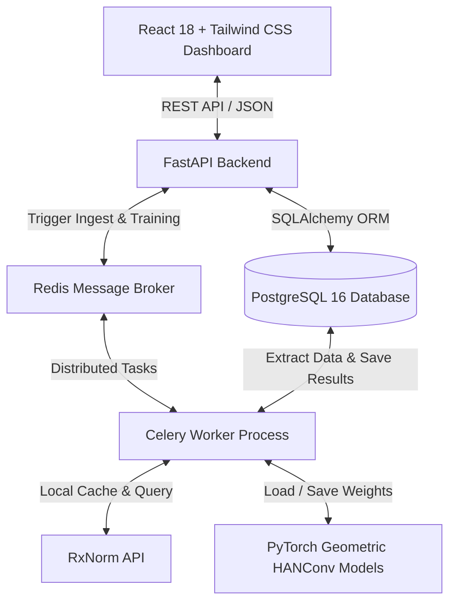
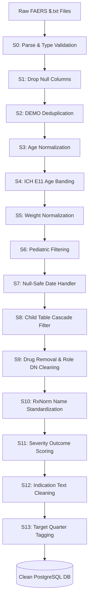
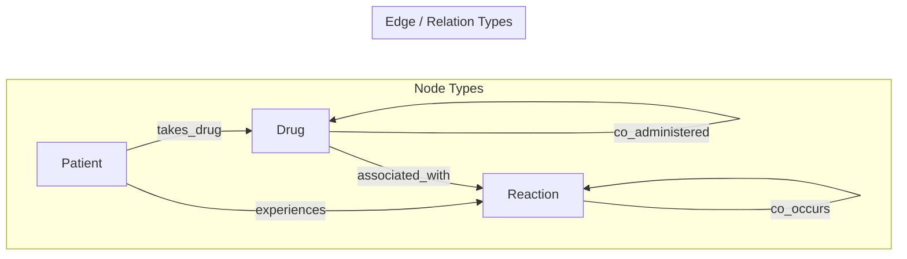

# PulseTech FAERS Pediatric ADR Dashboard

> [!IMPORTANT]
> **⚖️ Copyright Notice & Intellectual Property Registration**  
> * **Work Title:** PulseTech FAERS Pediatric ADR Dashboard  
> * **Authors & Claimants:** Atherv Deepak Telkar & Amey Deepak Telkar  
> * **Registration Class:** Computer Software / Literary Work (Under Copyright Registration Process, 2026)  
> * **Filing Organization:** PulseTech Team (ANC-031)  
> * **Rights Statement:** All rights reserved. Unauthorized copying, distribution, publishing, or reproduction of this source code, layout, or documentation in any form is strictly prohibited under international copyright laws.

[](#license)
[-blue.svg)](#team)
[](#features)


A **research-grade pharmacovigilance dashboard** for analyzing Adverse Drug Reactions (ADR) in the pediatric population using FDA FAERS data. By integrating a **13-step ETL pipeline**, standard **signal detection statistics**, and a **Heterogeneous Graph Attention Network (HANConv)**, this system identifies known and novel pediatric drug safety signals across specific developmental age bands.

---

## 👥 Authors & Team
* **Team Name**: PulseTech (ANC-031)
* **Authors**: **Atherv Deepak Telkar & Amey Deepak Telkar**
* **Institution**: MIT Vishwaprayag University

---

## 🏗️ System Architecture

The dashboard is built on a distributed microservices architecture designed to handle large-scale demographic and clinical event datasets.



---

## 🛠️ Tech Stack

| Layer | Technologies Used | Description |
|:---|:---|:---|
| **Frontend** | React 18, Vite, TailwindCSS 3, Recharts, Lucide Icons | Responsive, dark-themed dashboard UI with dynamic visualizations. |
| **Backend** | FastAPI (Python 3.11), SQLAlchemy, Alembic | Async REST API hosting database endpoints, background task triggers. |
| **Database** | PostgreSQL 16 | Relational store for normalized DEMO, DRUG, REAC, OUTC, and INDI tables. |
| **Task Queue** | Celery + Redis | Asynchronous ETL pipeline execution and model training to prevent API blocking. |
| **ML & GNN** | PyTorch, PyTorch Geometric (PyG) | Heterogeneous Graph building, HANConv architecture, link prediction. |
| **Pharmacovigilance** | PRR, ROR, IC (WHO-UMC), EBGM (DuMouchel GPS) | Statistical calculators with contingency tables for disproportionality. |

---

## 🔄 The 13-Step Data Ingestion & Cleaning Pipeline

Raw FDA FAERS data contains extensive duplicates, missing values, inconsistent units, and non-standard drug naming. The PulseTech ETL pipeline cleanses, normalizes, and filters raw inputs across 13 stages before committing entries to PostgreSQL.



### 📋 Detailed Pipeline Stages

| Step | Component / Module | Logic & Transformations Applied |
|:---:|:---|:---|
| **S0** | `validator.py` | Auto-detects file type (DEMO, DRUG, etc.) via header signatures. Validates delimiter integrity. |
| **S1** | `validator.py` | Drops technical columns with >90% null counts database-wide (e.g., `auth_num`, `lit_ref`, `mfr_num`). |
| **S2** | `deduplicator.py` | Deduplicates records using `caseid` + `MAX(caseversion)`. Tied records are broken using a 4-level fallback. |
| **S3** | `age_normalizer.py` | Converts ages reported in diverse units (Days, Weeks, Months, Years, Decades, Hours) to a single decimal years format. |
| **S4** | `age_normalizer.py` | Classifies patient into standard **ICH E11 age bands**: Neonate (<28d), Infant (28d-2y), Child (2y-12y), Adolescent (12y-18y). |
| **S5** | `age_normalizer.py` | Normalizes weight fields to kilograms (converting lbs, oz, g, mg). |
| **S6** | `pediatric_filter.py` | Drops rows where age is strictly $\ge 18$. Crucially retains reports where age is NULL to preserve signal count sensitivity. |
| **S7** | `date_handler.py` | Parses partial dates (e.g., YYYYMM, YYYY) using first-of-month / first-of-year imputations safely. |
| **S8** | `orchestrator.py` | Performs cascading join filters to clean child tables (DRUG, REAC, etc.) by removing rows belonging to discarded adult DEMO IDs. |
| **S9** | `deduplicator.py` | Removes invalid/corrupted drugs (`val_vbm` = 2) and filters out `role_cod` = 'DN' (Definitively Not Suspect) drugs. |
| **S10** | `drug_normalizer.py` | Cleans raw strings (removing dosages/forms), resolves synonyms via RxNorm API, and normalizes route variants. |
| **S11** | `outcome_scorer.py` | Maps multi-outcome letters to numeric severity scores: Death (7), Life-threatening (6), Hospitalization (5), Congenital (4), Disability (3), Required Intervention (2), Other (1). |
| **S12** | `orchestrator.py` | Cleans placeholder indication texts (e.g., 'UNKNOWN INDICATION') to database NULLs without discarding the primary row. |
| **S13** | `orchestrator.py` | Tags every single row with the source quarter metadata (e.g., `2025Q1`) for cross-quarter stacking and tracking. |

---

## 🏥 Understanding NULL vs. Unknown Ages

A key database constraint is preventing the loss of clinical reports that omit patient age. 

* **NULL (Empty Field)**: Indicates that the age field in the original report was blank. 
* **Unknown (Pipeline Flag)**: Set to `True` only if **both** the numeric age and the age group field (`age_grp`) are absent. If a report has no numeric age but indicates `age_grp = INF` (Infant), the pipeline estimates the age (e.g., 0.5 years) and maps it to the `INFANT` cohort.
* **Clinical Defense**: Omitting unknown ages would delete over **85%** of the raw data. Keeping them allows us to maintain critical safety signal sensitivity while preventing background denominator inflation.

---

## 🧠 GNN Model: Heterogeneous Graph Attention Network (HANConv)

To predict hidden or underreported adverse drug events, we model FAERS as a heterogeneous graph and apply a **Heterogeneous Graph Attention Network (HANConv)**.



### 🧬 Model Architecture & Ablation Study
The system trains separate GNN models for each **ICH E11 age band** to capture developmental drug-response variances.
* **Encoder**: Two-layer Heterogeneous Graph Attention Network (HANConv) with 4 attention heads in Layer 1 (dropout=0.3) and a single head in Layer 2.
* **Decoder**: Dot-product link predictor computing edge probability between Drug and Reaction nodes.
* **Ablation Study**: Compares GNN validation performance across 4 configurations:
  1. **Full Config** (Cohort nodes + co-administration edges) - *Highest ROC-AUC*
  2. **No Co-administration** (No co-admin edges)
  3. **No Cohort** (Strictly single drug-reaction pairs)
  4. **Minimal Network** (Sparse topology)

---

## 📊 Disproportionality Signal Detection
Disproportionality analysis measures whether a specific drug-reaction pairing occurs more frequently in a pediatric cohort than would be expected by chance. The dashboard computes 4 classic pharmacovigilance metrics using a $2 \times 2$ contingency table:

$$\begin{array}{c|cc}
& \text{Reaction of Interest} & \text{Other Reactions} \\
\hline
\text{Drug of Interest} & a & b \\
\text{Other Drugs} & c & d \\
\end{array}$$

* **PRR (Proportional Reporting Ratio)**: Measures the relative proportion of the reaction among reports for this drug compared to others.
* **ROR (Reporting Odds Ratio)**: Calculates the odds of the reaction occurring in reports containing the target drug compared to reports without it.
* **IC (Information Component)**: Logarithmic measure of disproportionality adapted from the WHO-UMC database.
* **EBGM (Empirical Bayes Geometric Mean)**: Multi-item gamma-Poisson model providing shrinkage for low cell counts.

---

## 🖥️ 7-Page Dashboard Features

1. **Upload Hub**: Upload raw, multi-quarter FAERS files. Monitors real-time parsing progress with background worker status.
2. **Demographics**: Interactive age-sex pyramids, weight distributions, and geographical maps of reporting reporters.
3. **ADR Analysis**: Ranks top adverse reactions, drug frequencies, and severity scores across developmental age groups.
4. **Signal Detection**: Filter and search PRR, ROR, IC, and EBGM metrics with custom threshold configurations.
5. **GNN Network**: Visualizes predicted drug-reaction associations alongside model training loss curves.
6. **Outcomes**: Breakdown of severity levels (Death, Hospitalization, etc.) by age bands.
7. **Report Builder**: Generates structured summaries with dynamic graphs and lets you export a PDF report.

---

## 🚀 Quick Start

### 1. Run via Docker Compose (Recommended)
This starts all components (Database, Cache, Backend, Worker, Frontend) automatically:
```bash
docker-compose up --build -d
```

### 2. Manual Startup (Windows / PowerShell)

#### **Backend & Celery (Terminal 1 & 2)**
Ensure python 3.11 is installed, then set up the environment:
```powershell
# In a fresh terminal, install dependencies
pip install -r backend/requirements.txt

# Run Backend
$env:SKIP_RXNORM="1"
$env:PYTHONIOENCODING="utf-8"
cd backend
uvicorn app.main:app --host 0.0.0.0 --port 8000 --reload
```
```powershell
# In a second terminal, start Celery
cd backend
celery -A celery_worker worker --loglevel=info
```

#### **Frontend (Terminal 3)**
```powershell
cd frontend
npm install
npm run dev
```

### 3. Verification Addresses
* **Dashboard Front-end**: [http://localhost:5173](http://localhost:5173)
* **Interactive API Docs (Swagger)**: [http://localhost:8000/docs](http://localhost:8000/docs)
* **API Health Check**: [http://localhost:8000/api/health](http://localhost:8000/api/health)

---

## 📁 Repository Structure

```
faers-pediatric-adr/
├── backend/                  # FastAPI Application
│   ├── app/
│   │   ├── pipeline/         # ETL Processing Engine
│   │   ├── analytics/        # Disproportionality Metrics (PRR, ROR, EBGM, IC)
│   │   ├── gnn/              # PyTorch Heter heterogeneous GNN (HANConv)
│   │   └── routers/          # API Endpoints
│   ├── alembic/              # DB Schema Versioning / Migrations
│   └── celery_worker.py      # Background Task Entry Point
├── frontend/                 # React 18 SPA
│   ├── src/
│   │   ├── pages/            # 7 Dashboard Pages
│   │   └── security.js       # Security Watermarks & Obfuscation Handles
│   └── vite.config.js        # Obfuscating Bundler Setup
├── docker-compose.yml        # Orchestration Config
└── README.md                 # System Documentation (This File)
```

---

## 📜 License
Educational & Research Use Only — **PulseTech Team (ANC-031)**. 
All rights reserved © 2026.
